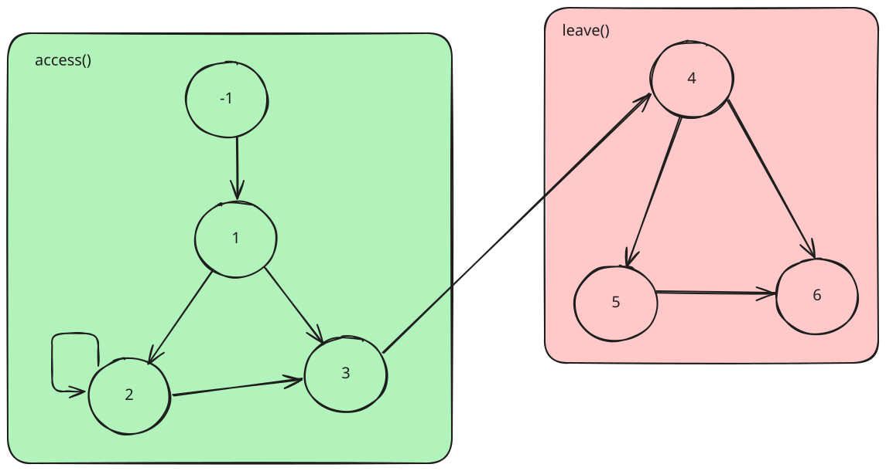

# Laboratoire 7 : Model checking <!-- omit from toc -->

## Etudiants <!-- omit from toc -->

- Calum Quinn
- Urs Behrmann

# Table des matières

- [Table des matières](#table-des-matières)
- [Introduction](#introduction)
- [Conception](#conception)
  - [Choix d'implémentation](#choix-dimplémentation)
- [Tests](#tests)
- [Conclusion](#conclusion)

# Introduction

Nous avons choisi d'implémenter l'exercice 13.1 (Bridge Manager Float).

Le corrigé de l'exercice a été repris et légèrement adapté pour utiliser la librairie de test de concurrence.

# Conception

Notre solution repose sur le bon placement des commandes de sections pour assurer les tests de tous les scénarios différents.

## Choix d'implémentation

L'implémentation de l'exercice 13 nous a amené au graphe de scénario suivant.

Nous faisons des `startSection(x)` aux endroits où il pourrait y avoir une biffurcation. Par exemple si nous avons un `if` dans le code, nous aurons une section avant, une section à l'intérieur et une dernière après. Ceci représente efficacement toutes les possibilités d'exécution. (`Avant` -> `Après` et `Avant` -> `Pendant` -> `Après`)

# Tests

Pour valider notre solution, nous avons mis en œuvre les étapes suivantes :

1. *Vérification de la gestion des sémaphores* : Nous avons utilisé le framework pour vérifier que les threads attendent correctement lorsque le poids maximal est dépassé.

2. *Test des scénarios* : Nous avons défini plusieurs scénarios avec des nombres de véhicules différents pour observer différents cas de dépassement ou de non-dépassement du poids maximal. Le framework a généré tous les scénarios possibles en respectant les séquences instrumentalisées.

3. *Résultats attendus* : Les résultats des tests montrent que :
        Aucun scénario ne se termine par un deadlock ou un dépassement du poids maximal.
        Tous les scénarios finissent soit en `AllScenario` soit en `DeadEnd`.

4. *Limitation du nombre de scénarios* : Nous avons du jouer avec le nombre total de scénarios générés en ajustant la profondeur des tests pour éviter de bloquer certains scénarios valide dû au nombre d'étapes.

# Conclusion

La dificulté principale de ce laboratoire était de comprendre où exactement placer le code de l'exercice.
Une fois ceci fait nous avons pu implémenter différents scénarios et graphes avant d'arriver à la version finale.

Au vu de la nature de la librairie qui passe à travers toutes les possibilités de scénarios, il faut faire attention à ne pas mettre
trop de threads et ou de `startSection(x)`. La quantité de scénarios et exponentiellement proportionnel aux nombre de threads et sections.

6 sections par thread (comme il est notre cas) semble être un juste milieu entre les scénarios testés et un temps d'exécution raisonable.

